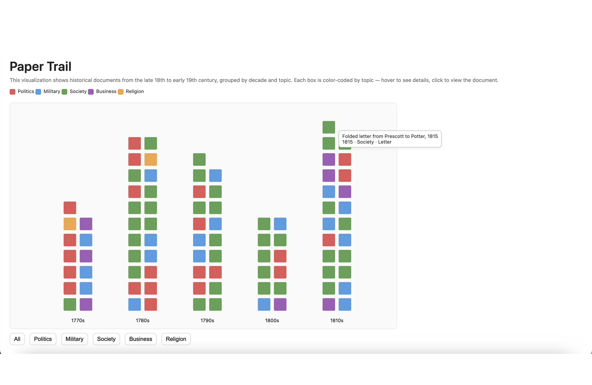
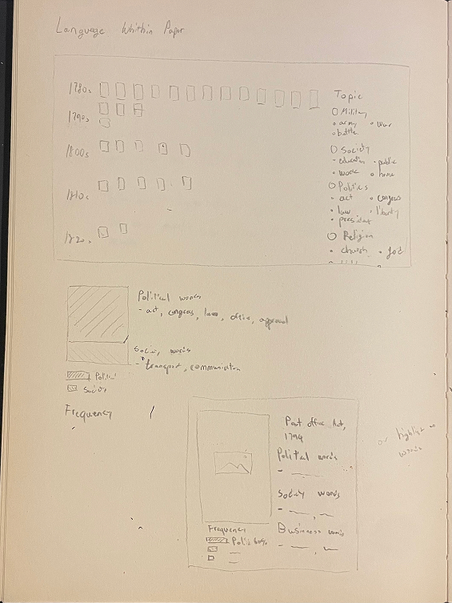
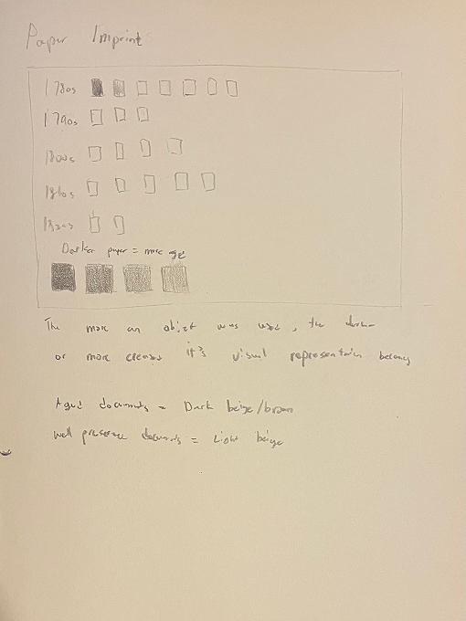
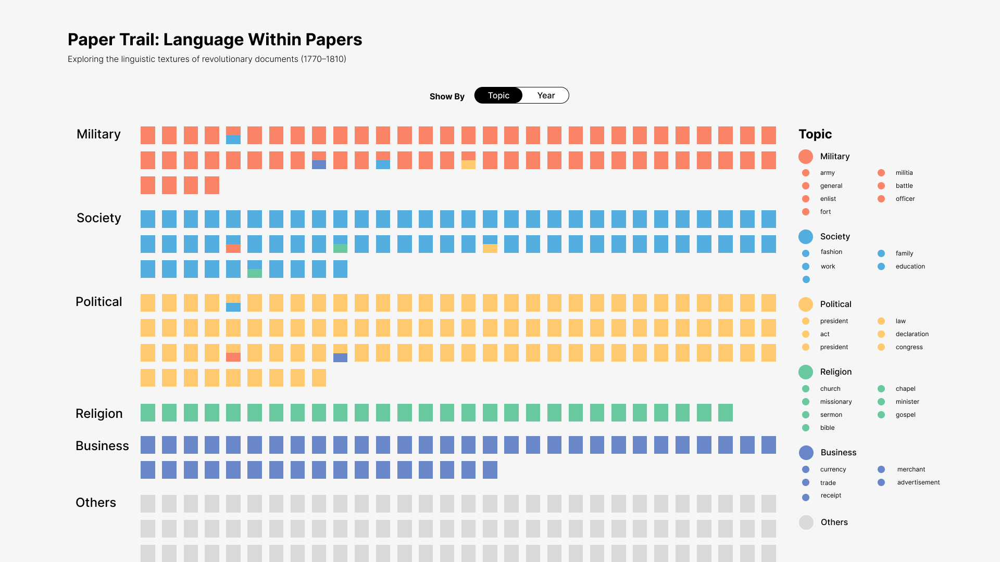
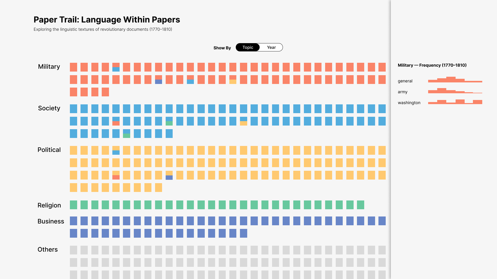
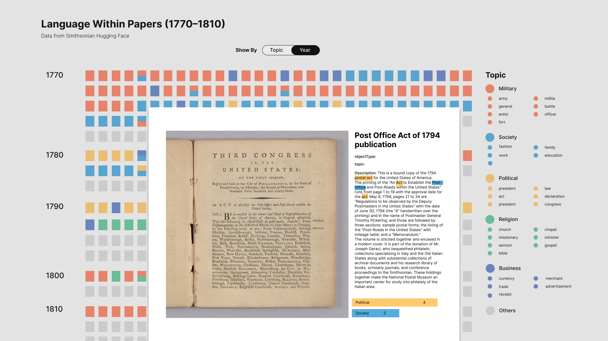

# Interactive Concepts & Visual Progress (Paper Trail)

This is my process archive documenting how Paper Trail evolved — from first sketches to the current interface. It records the choices I made, what I learned each week, and how each iteration shaped the final direction.

---

## Early sketches

**PaperTrail**

In the first week, I began with a simple publication timeline.
Each small rectangle represented one document, placed roughly from left to right (1770 → 1810). I wanted to see whether density alone could communicate something meaningful.

While sketching, I discovered that:
- working with individual units—rather than bars or lines—felt closer to an archival wall
- this is where the idea of a tile-based mosaic first emerged

**What It's Made Of**

At the same time, I explored a completely different question:
what were these objects physically made of?

Because many entries include a “physical description,” I wondered whether visualizing materials (paper, wood, silk, metal, fabric, etc.) by decade could reveal patterns in object types across the archive.
This sketch didn’t move forward, but it opened up a way of thinking about the tactile quality of documents.

---

## Visual Experiments (first prototypes)

This was the earliest coded prototype. Every square was a document, grouped by decade and filterable by topic.
Only one topic displayed at a time — in this screenshot, Politics.

Key observations:

- decade grouping immediately made gaps and clusters visible
- filtering by topic helped, but showing only one color at a time felt limited
- the layout was clean but a little empty, since tiles didn’t interact yet
- hover interactions surfaced details but didn’t create a narrative flow

Still, this confirmed that the tile-as-document metaphor was strong, even before adding design structure.

---

## Early Qualitative Sketches

**Language Within Papers**

After exploring time-based structure, I wondered what it might look like to visualize the language inside each document.

This wasn’t a finished idea — more of a test to see if internal features (keywords, topic frequency, or simple highlights) could become part of the tile representation.
Even as a rough sketch, it helped me think about documents as more than metadata: each one has an internal “texture.”

**Paper Imprint**

I also briefly experimented with the idea of using shading to represent how worn or aged a document looks.

It was never meant to be implemented, but it influenced the softer palette choices I later made, and kept me thinking about the material nature of the archive.

---

## First Visual Mockups in Figma

**Topic-Based Layout**

This mockup reorganized the grid by topic.
It was my first test of:

- color-coded categories
- showing all documents at once
- maintaining a tile-based visual language

**Adding a Frequency Panel**

I also tried adding a side panel showing keyword frequencies for each topic.

The numbers weren’t real — this was a conceptual test to see how multiple layers could coexist with the grid without overwhelming it.

**Full document view**

This mockup imagined what clicking a tile would look like.
The structure — image on the left, metadata on the right, topic counts below — eventually became the foundation for the final detail overlay.

## Interaction Sketches

As the project grew, I moved my sketching workflow to Excalidraw so I could iterate more cleanly. I explored three different interaction concepts before deciding which direction to pursue.

**Interactive Map**

A mid-landing interactive map where each circle represented a topic’s activity in a specific city and year.
Circle size reflected the number of documents; colors followed the topic palette.
As the user scrolled, the map updated year by year — showing how Revolutionary language spread geographically.

**Interactive Text Explorer**

In the detail view, hovering over highlighted words would open a small tooltip:

- the word’s assigned topic

- nearby co-occurring terms

- other sentences in which the word appears

This was designed to show how ideas coexist and interact within a single document — almost like mapping the semantic atmosphere inside historical texts.

**Interactive Timeline**

This concept added a timeline slider (1770–1810) that let users explore how dominant topics shift across decades.
Documents from the selected year would appear at full opacity while all others faded, turning the mosaic into a kind of “visual pulse” of historical activity.

## Final Direction — Image Slider + Close-Up Detail Panel

Ultimately, I realized the most meaningful interaction was not about geographical movement or timeline filtering — it was about providing a clear, archival way to inspect documents more closely.

This led to the final model:

✔ Image Slider for multi-page documents

✔ Close-Up Detail Panel pairing the document image with metadata and topic mix

This approach preserved the archival feeling of the project, kept the mosaic structure intact, and gave users the depth they needed when exploring each document.