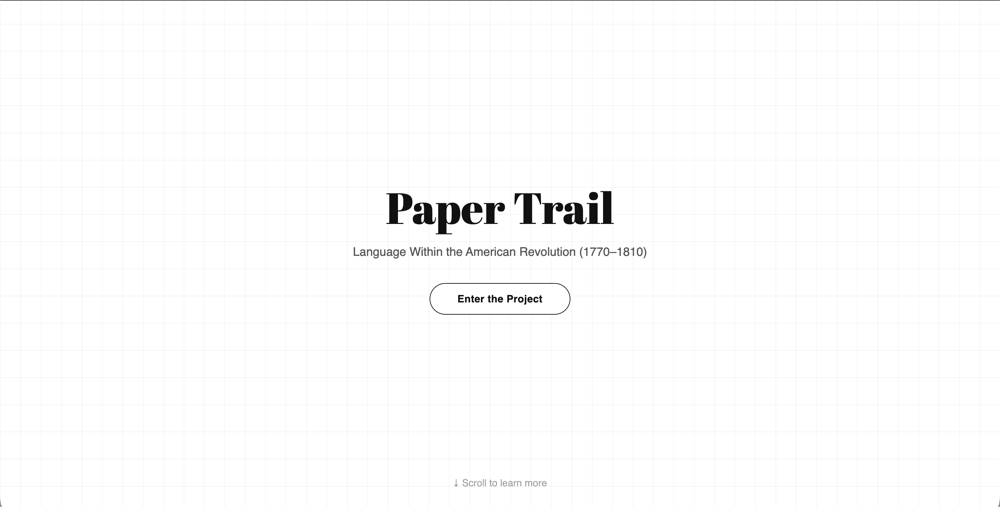
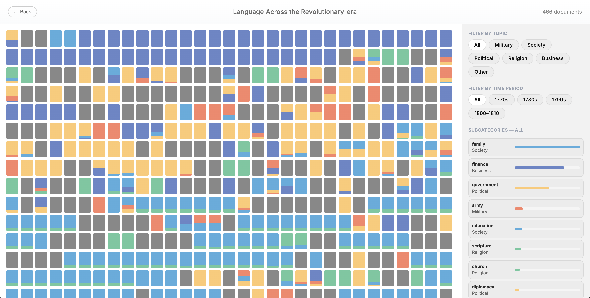

# Paper Trail

An interactive exploration of language within Revolutionary-era documents (1770–1810) from the Smithsonian Institution.

## 🔗 Live Demo

**[View Project →](https://hoonkim0123.github.io/major-studio-1/)**

## 📖 About

Paper Trail visualizes **466 documents** from the American Revolutionary period, revealing how language circulated across different contexts. Each document is classified by topic—**Military**, **Society**, **Political**, **Religion**, and **Business**—creating a mosaic that traces linguistic patterns and connections.

Rather than showing how words changed over time, this project illuminates the **interconnected networks of revolutionary language** across letters, pamphlets, broadsides, and official documents.

### Features

- **Interactive mosaic visualization** with 466 historical documents
- **Topic-based filtering** across five categories
- **Time period filtering** by decade (1770–1810)
- **Document detail view** with high-resolution images and metadata
- **Multi-page document support** with thumbnail navigation
- **Keyword highlighting** based on topic classification
- **Responsive design** for desktop and mobile

## 🎨 Visual Design

Each tile represents a document:
- **Color** indicates the dominant topic
- **Position** follows chronological order (1770–1810)
- **Hover** reveals document preview and metadata
- **Click** opens full detail view with images and description

## 🧭 Process & Sketches

This repository includes a process archive documenting sketches, visual experiments, and interaction decisions for Paper Trail. See the full narrative and images in the Sketches process document:

- [Concepts & Visual Progress Process Archive)](Progress/README.md)
 - [Concepts & Visual Progress (Process Archive)](Progress/README.md)

## 📊 Data

- **Primary Source**: [Smithsonian Institution Collections](https://collections.si.edu/search/)
- **Dataset Repository**: [Hugging Face - Revolutionary Era Collections](https://huggingface.co/datasets/RevolutionCrossroads/si_us_revolutionary_era_collections)
- **Document Count**: 466 text-based historical documents
- **Date Range**: 1770–1810
- **Image Source**: Smithsonian API with multi-page support

## 📝 Author

**Saehun Kim** (he/him)  
MS Data Visualization '25  
Parsons School of Design 
